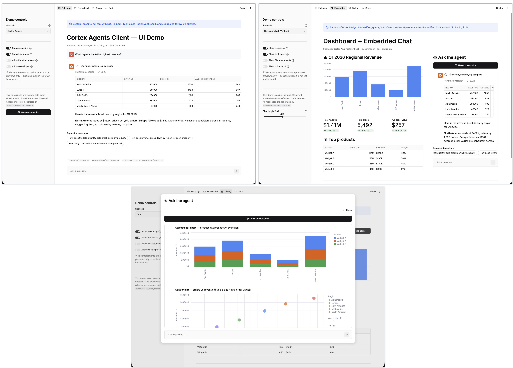

# streamlit-cortex-agents
---

[](https://docs.snowflake.com/en/user-guide/snowflake-cortex/cortex-agents)
[](https://streamlit.io)

This library is a drop-in Cortex Agent chatbot for Streamlit. It adds a complete, streaming AI chat interface to any Streamlit app in a few lines of code:

> [!NOTE]
> **Unofficial community project.** It is not an official Snowflake offering, and Snowflake does not support it. See [Disclaimer](#disclaimer).

> [!IMPORTANT]
> **Requires Streamlit 1.64 or later** (`streamlit>=1.64`). The chat UI uses `st.chat_input(submit_mode="stop")`, `st.status(type="step")` and `st.pills`, which older versions do not have. In Streamlit in Snowflake, pin `streamlit[snowflake]>=1.64` in `pyproject.toml`.

**Streamlit in Snowflake (container runtime):**

```python
# streamlit-app.py — Full-page chatbot (chat input pinned to bottom)
import streamlit as st
from streamlit_cortex_agents.chat import CortexAgentChat
from streamlit_cortex_agents.client.auth import SiSContainerAuth, account_url_from_env

AGENT_PATH = "MY_DB.MY_SCHEMA.MY_AGENT"  # ← swap this

CortexAgentChat(
    account_url=account_url_from_env(),
    auth=SiSContainerAuth(),
    agent_path=AGENT_PATH,
    show_thinking=True,
    show_tool_status=True,
    new_conversation_button=True,
    input_placeholder="Ask a question...",
).render()
```

**External Streamlit (local / hosted):**

```python
from streamlit_cortex_agents.chat import CortexAgentChat
import streamlit as st

CortexAgentChat(
    account_url=st.secrets["SNOWFLAKE_ACCOUNT_URL"],
    auth=st.secrets["SNOWFLAKE_PAT"],
    agent_path="MY_DB.MY_SCHEMA.MY_AGENT",
).render()
```



The library also includes the complete Python client for the Cortex Agents REST API (`streamlit_cortex_agents.client`). You can use the client on its own in scripts, notebooks, or custom integrations.

> **Want a no-code experience?** Consider [Snowflake CoWork](https://docs.snowflake.com/en/user-guide/snowflake-cortex/snowflake-cowork) for delivering agents to users without building a custom app.

## Features out of the box

- Streaming text with typewriter effect
- Tables and charts
- Tool execution status with SQL display
- Citation sources
- Suggested follow-up questions
- A collapsible reasoning timeline of thinking and tool steps
- Full conversation history across reruns
- A Stop button in the chat input that cancels the agent run on the server, not just the display

## Layout modes

- `"fullpage"` (default): chat input pinned to the bottom
- `"embedded"`: scrollable container for dashboards, sized in pixels or with a CSS height that can fill the window
- Inside an `st.dialog`: a modal chat overlay

## Try the demo

The mock demo app shows the chat component working without a Snowflake account or credentials. Canned event streams in `examples/demo/mock_thread.py` stand in for the agent.

```bash
git clone https://github.com/sfc-gh-tmeacham/streamlit-cortex-agents.git
cd streamlit-cortex-agents
uv sync
uv run streamlit run examples/demo/app.py
```

On macOS with Apple silicon, prefix the last command with `ARROW_DEFAULT_MEMORY_POOL=system MALLOC_NANO_ZONE=0` to avoid a PyArrow crash.

Streamlit opens the app at `http://localhost:8501`. Then:

- Use the top navigation to switch between the **Full page**, **Embedded**, and **Dialog** layouts.
- Pick a **Scenario** in the sidebar to see different agent responses: thinking, Cortex Search citations, Cortex Analyst SQL with tables, charts, clarification requests, warnings, errors, or a kitchen sink of every event type.
- Toggle **Show reasoning** and **Show tool status** to see what those options change.
- Open the **Code** page for copy-paste snippets of each layout.

## Documentation

| Document | Covers |
|---|---|
| [Streamlit-in-Snowflake](docs/sis.md) | Container runtime setup: External Access Integrations, authentication, layout modes, deployment, RBAC |
| [Streamlit integration guide](docs/streamlit_guide.md) | `CortexAgentChat` options, external Streamlit setup, manual integration, attachments, client-side tools, multi-tenancy |
| [Python client](docs/python_api.md) | `CortexAgentsClient`: authentication, runs, background runs, cancellation, agents, threads, session attributes, exceptions |
| [Reference](docs/reference.md) | Parameter tables, widget keys, secrets and environment variables, tests, demo app, architecture |
| [Event types](docs/event_types.md) | Wire-level SSE event payloads |
| [REST API spec](docs/api_spec.md) | Cortex Agents REST endpoints used by the client |
| [Live integration tests](tests/live/README.md) | Running the test suite against a real account |
| [Changelog](CHANGELOG.md) | Version history |

## Installation

> [!IMPORTANT]
> Requires **Streamlit 1.64 or later**. Streamlit, pandas, and httpx are installed as core dependencies.

This library is not published to PyPI. The source is on [GitHub](https://github.com/sfc-gh-tmeacham/streamlit-cortex-agents). Clone the repository and install from the local directory.

For Streamlit-in-Snowflake, copy `src/streamlit_cortex_agents/` into your workspace instead. See [Deploying the app](docs/sis.md#deploying-the-app).

### uv (recommended)

[uv](https://docs.astral.sh/uv/) is required for Streamlit in Snowflake Workspaces and is the recommended tool for any project that may be deployed there.

```bash
# Library (includes Streamlit)
uv add /path/to/streamlit-cortex-agents

# With JWT key-pair authentication
uv add "/path/to/streamlit-cortex-agents[jwt]"
```

### pip

```bash
# Library (includes Streamlit)
pip install /path/to/streamlit-cortex-agents

# With JWT key-pair authentication
pip install "/path/to/streamlit-cortex-agents[jwt]"
```

## Python client quick start

```python
from streamlit_cortex_agents import CortexAgentsClient
from streamlit_cortex_agents.client.models.events import TextDeltaEvent

client = CortexAgentsClient(
    account_url="https://myorg-myaccount.snowflakecomputing.com",
    auth="v2:my_pat_token",
    default_database="MY_DB",
    default_schema="MY_SCHEMA",
)

thread = client.create_thread()
for event in thread.chat("MY_AGENT", "What was total revenue in 2025?"):
    if isinstance(event, TextDeltaEvent):
        print(event.text, end="", flush=True)
```

See [Python client](docs/python_api.md) for multi-turn conversations, all event types, background runs, and agent management.

---

## Limitations

- **Attachments are not sent to the agent.** With `accept_file` or `accept_audio` enabled, files and audio appear in the chat and are kept for replay, but only the text prompt is sent. See [File and audio attachments](docs/streamlit_guide.md#file-and-audio-attachments).
- **Streamlit-in-Snowflake apps run with the owner's rights.** `SiSContainerAuth` uses the app owner's token, and restricted caller's rights do not extend to the Cortex Agents REST API. Every viewer gets the owner's agent access. See [RBAC and role considerations](docs/sis.md#rbac-and-role-considerations).
- **Streamlit-in-Snowflake requires the container runtime.** Warehouse runtime apps cannot call the Cortex Agents API.
- **Not on PyPI.** Install from a clone of the GitHub repository. See [Installation](#installation).
- **Unofficial and unsupported.** See [Disclaimer](#disclaimer).

## Official documentation

**Cortex Agents**

| Page | What it covers |
|---|---|
| [Cortex Agents](https://docs.snowflake.com/en/user-guide/snowflake-cortex/cortex-agents) | Overview of agents, tools, orchestration, and access control |
| [Create and manage agents](https://docs.snowflake.com/en/user-guide/snowflake-cortex/cortex-agents-manage) | Agent object CRUD, tool configuration, and required privileges |
| [Cortex Agents Run API](https://docs.snowflake.com/en/user-guide/snowflake-cortex/cortex-agents-run) | The `agent:run` endpoints, request body, and streamed response events |
| [Threads API](https://docs.snowflake.com/en/user-guide/snowflake-cortex/cortex-agents-threads-rest-api) | REST reference for creating, listing, describing, and deleting threads |
| [Use threads with the Agent REST API](https://docs.snowflake.com/en/user-guide/snowflake-cortex/cortex-agents-threads) | Multi-turn conversations, `parent_message_id`, forking, and compaction summaries |
| [Multi-tenancy for Cortex Agents](https://docs.snowflake.com/en/user-guide/snowflake-cortex/cortex-agents-multi-tenancy) | Session attributes and row access policies for per-tenant data isolation |

**Authentication**

| Page | What it covers |
|---|---|
| [Authenticating Snowflake REST APIs](https://docs.snowflake.com/en/developer-guide/snowflake-rest-api/authentication) | Key-pair JWT, OAuth, PAT, and workload identity headers for REST calls |
| [Programmatic access tokens](https://docs.snowflake.com/en/user-guide/programmatic-access-tokens) | Creating, scoping, and rotating PATs |
| [Key-pair authentication](https://docs.snowflake.com/en/user-guide/key-pair-auth) | Generating an RSA key pair and assigning the public key to a user |

**Streamlit in Snowflake**

| Page | What it covers |
|---|---|
| [Runtime environments](https://docs.snowflake.com/en/developer-guide/streamlit/app-development/runtime-environments) | Container runtime versus warehouse runtime |
| [Manage dependencies](https://docs.snowflake.com/en/developer-guide/streamlit/app-development/dependency-management) | `pyproject.toml`/`requirements.txt`, artifact repositories, and the PyPI EAI |
| [External network access](https://docs.snowflake.com/en/developer-guide/streamlit/features/external-access) | Attaching external access integrations to an app |
| [Owner's rights](https://docs.snowflake.com/en/developer-guide/streamlit/object-management/owners-rights) | Why an app runs with its owner's privileges |
| [Restricted caller's rights](https://docs.snowflake.com/en/developer-guide/streamlit/features/restricted-callers-rights) | Running connections with the viewer's privileges in container runtimes |
| [Logging and tracing](https://docs.snowflake.com/en/developer-guide/streamlit/features/logging-tracing) | Capturing app logs and traces in an event table |

**Streamlit**

| Page | What it covers |
|---|---|
| [Streamlit documentation](https://docs.streamlit.io) | Official Streamlit docs home |
| [Chat elements](https://docs.streamlit.io/develop/api-reference/chat) | `st.chat_message`, `st.chat_input`, and related chat APIs |
| [st.chat_input](https://docs.streamlit.io/develop/api-reference/chat/st.chat_input) | Chat input options, including file and audio attachments and `submit_mode` |
| [st.dialog](https://docs.streamlit.io/develop/api-reference/execution-flow/st.dialog) | Modal dialogs used for the dialog layout pattern |
| [Session State](https://docs.streamlit.io/develop/concepts/architecture/session-state) | How values persist across reruns, which the chat history relies on |
| [Secrets management](https://docs.streamlit.io/develop/concepts/connections/secrets-management) | `.streamlit/secrets.toml` and `st.secrets` for external apps |

**Related**

| Page | What it covers |
|---|---|
| [Snowflake CoWork](https://docs.snowflake.com/en/user-guide/snowflake-cortex/snowflake-cowork) | No-code interface for delivering agents to users |

---

## Disclaimer

This project is **not an official Snowflake offering**. It is provided as-is with no warranties, express or implied. Snowflake does not provide support for this library. Use at your own risk.

This software is not covered by any Snowflake support agreement or SLA. For issues, please open a GitHub issue in this repository.
