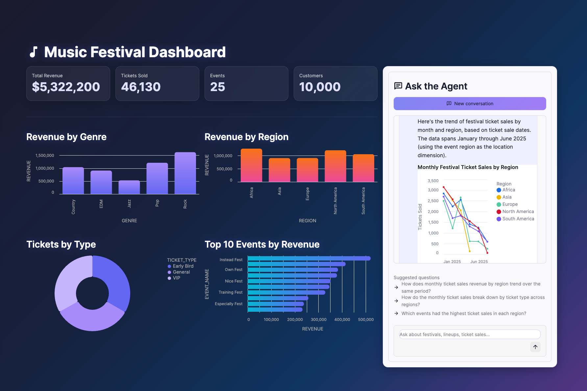

# cortex-agents-client
---

[](https://docs.snowflake.com/en/user-guide/snowflake-cortex/cortex-agents)
[](https://streamlit.io)

Drop-in Cortex Agent chatbot for Streamlit. Add a fully functional, streaming AI chat interface to any Streamlit app in a few lines of code:

**Streamlit in Snowflake (container runtime):**

```python
# streamlit-app.py — Full-page chatbot (chat input pinned to bottom)
import streamlit as st
from cortex_agents_client.st import StreamlitChatbot
from cortex_agents_client.auth import SiSContainerAuth, account_url_from_env

AGENT_PATH = "MY_DB.MY_SCHEMA.MY_AGENT"  # ← swap this

StreamlitChatbot(
    account_url=account_url_from_env(),
    auth=SiSContainerAuth(),
    agent_path=AGENT_PATH,
    show_thinking=True,
    show_tool_status=True,
    new_conversation_button=True,
    input_placeholder="Ask a question...",
).render()
```

**External Streamlit (local / hosted):**

```python
from cortex_agents_client.st import StreamlitChatbot
import streamlit as st

StreamlitChatbot(
    account_url=st.secrets["SNOWFLAKE_ACCOUNT_URL"],
    auth=st.secrets["SNOWFLAKE_PAT"],
    agent_path="MY_DB.MY_SCHEMA.MY_AGENT",
).render()
```

Features out of the box: streaming text with typewriter effect, tables and charts, tool execution status with SQL display, citation sources, suggested follow-up questions, thinking/reasoning expanders, and full conversation history across reruns.

**Layout modes:** `"fullpage"` (default — chat input pinned to bottom), `"embedded"` (fixed-height scrollable container for dashboards), or render inside an `st.dialog` for a modal chat overlay.



Also includes the complete Python client library for the Cortex Agents REST API — use it standalone for scripts, notebooks, or custom integrations without Streamlit.

> **Want a no-code experience?** Consider [Snowflake CoWork](https://docs.snowflake.com/en/user-guide/snowflake-cortex/snowflake-cowork) for delivering agents to users without building a custom app.

## Installation

This library is not currently published to PyPI or a public Git repository. Install it directly from a local clone of the project directory.

> **Streamlit-in-Snowflake (container runtime)**: copy the `cortex_agents_client/` folder directly into your workspace and update your `pyproject.toml` as shown below. See [Streamlit-in-Snowflake](#streamlit-in-snowflake-container-runtime).
>
> ```toml
> [project]
> name = "streamlit-app"
> requires-python = "~=3.11.0"
> version = "0.0.1"
> description = ""
> dependencies = [
>     "streamlit[snowflake]>=1.59",
>     "pandas",
>     "requests",
>     "httpx",
> ]
>
> [tool.setuptools.packages.find]
> include = ["cortex_agents_client*"]
>
> [tool.uv]
> constraint-dependencies = ["numba>=0.56.0"]
> exclude-newer = "7 days"
>
> [tool.uv.exclude-newer-package]
> streamlit = false
> ```

### uv (recommended)

[uv](https://docs.astral.sh/uv/) is required for Streamlit in Snowflake Workspaces and is the recommended tool for any project that may be deployed there.

```bash
# Core library
uv add /path/to/cortex-agents-client

# With Streamlit rendering support
uv add "/path/to/cortex-agents-client[streamlit]"

# With JWT key-pair authentication
uv add "/path/to/cortex-agents-client[jwt]"

# Everything
uv add "/path/to/cortex-agents-client[streamlit,jwt]"
```

### pip

```bash
# Core library
pip install /path/to/cortex-agents-client

# With Streamlit rendering support
pip install "/path/to/cortex-agents-client[streamlit]"

# With JWT key-pair authentication
pip install "/path/to/cortex-agents-client[jwt]"

# Everything
pip install "/path/to/cortex-agents-client[streamlit,jwt]"
```

---

## Core Python API

The sections below apply to all environments — scripts, notebooks, external Streamlit, and SiS.

### Authentication

> **Streamlit-in-Snowflake (container runtime)**: credentials are injected automatically by Snowflake. Use `SiSContainerAuth()` — no token management needed. See [Streamlit-in-Snowflake → Authentication](#sis-authentication).

#### PAT (Programmatic Access Token) — recommended

```python
client = CortexAgentsClient(
    account_url="https://myorg-myaccount.snowflakecomputing.com",
    auth="v2:my_pat_token",   # plain string → auto-wrapped as PATAuth
)
```

#### JWT (RSA key-pair)

Requires the `[jwt]` extra — see [Installation](#installation).

```python
from cortex_agents_client.auth import JWTAuth

auth = JWTAuth(
    account="myorg-myaccount",
    user="MYUSER",
    private_key_path="/path/to/rsa_key.p8",
    passphrase=b"optional_passphrase",
)
client = CortexAgentsClient("https://myorg.snowflakecomputing.com", auth)
```

#### OAuth

```python
from cortex_agents_client.auth import OAuthAuth

auth = OAuthAuth("my_oauth_token")
client = CortexAgentsClient("https://myorg.snowflakecomputing.com", auth)
```

### Quick start

```python
from cortex_agents_client import CortexAgentsClient
from cortex_agents_client.models.events import TextDeltaEvent

client = CortexAgentsClient(
    account_url="https://myorg-myaccount.snowflakecomputing.com",
    auth="v2:my_pat_token",
    default_database="MY_DB",
    default_schema="MY_SCHEMA",
)

thread = client.create_thread()
for event in thread.chat("MY_AGENT", "What was total revenue in 2025?"):
    if isinstance(event, TextDeltaEvent):
        print(event.text, end="", flush=True)
```

### Multi-turn conversations

The `Thread` class tracks `parent_message_id` automatically so you never have to manage it:

```python
thread = client.create_thread(origin_application="my_app")

# First turn
for event in thread.chat("MY_AGENT", "What was revenue in 2025?"):
    if isinstance(event, TextDeltaEvent):
        print(event.text, end="")

# Second turn — uses correct parent_message_id automatically
for event in thread.chat("MY_AGENT", "How does that compare to 2024?"):
    if isinstance(event, TextDeltaEvent):
        print(event.text, end="")
```

### Handling all event types

```python
from cortex_agents_client.models.events import (
    AnalystDeltaEvent,
    ChartEvent,
    ErrorEvent,
    MetadataEvent,
    ResponseEvent,
    StatusEvent,
    SuggestedQueriesEvent,
    TableEvent,
    TextAnnotationEvent,
    TextDeltaEvent,
    TextEvent,
    ThinkingDeltaEvent,
    ThinkingEvent,
    ToolResultEvent,
    ToolResultStatusEvent,
    ToolUseEvent,
    UnknownEvent,
    WarningEvent,
)

for event in thread.chat("MY_AGENT", "Show me the top 5 customers by revenue"):
    if isinstance(event, TextDeltaEvent):
        print(event.text, end="", flush=True)

    elif isinstance(event, TextEvent):
        # Full text after all deltas — use for non-streaming assembly
        pass  # already printed via TextDeltaEvent above

    elif isinstance(event, TableEvent):
        print(f"\nTable: {event.title}")
        print(f"  Rows: {event.result_set['resultSetMetaData']['numRows']}")

    elif isinstance(event, ChartEvent):
        import json
        spec = json.loads(event.chart_spec)  # Vega-Lite v5 dict
        print(f"\nChart type: {spec.get('mark')}")

    elif isinstance(event, ThinkingEvent):
        print(f"\n[Thinking: {event.text[:80]}...]")

    elif isinstance(event, ToolUseEvent):
        print(f"\n[Using tool: {event.name} (type: {event.type})]")
        if event.permission_options:
            print(f"  Permission required: {event.permission_options}")

    elif isinstance(event, ToolResultEvent):
        print(f"\n[Tool {event.tool_use_id} completed: {event.status}]")

    elif isinstance(event, AnalystDeltaEvent):
        # Deprecated (Apr 2026) — SQL now arrives in ToolUseEvent.input["sql"]
        # for events with type="system_execute_sql". Kept for backward compat.
        if event.sql:
            print(f"\n[SQL]: {event.sql[:120]}")

    elif isinstance(event, WarningEvent):
        print(f"\n[Warning {event.code}]: {event.message}")

    elif isinstance(event, ErrorEvent):
        print(f"\n[Error {event.code}]: {event.message}")

    elif isinstance(event, MetadataEvent):
        print(f"\n[{event.role} message saved: id={event.message_id}]")

    elif isinstance(event, TextAnnotationEvent):
        print(f"\n[Citation {event.index}: {event.doc_title} (doc_id={event.doc_id})]")

    elif isinstance(event, ThinkingDeltaEvent):
        print(event.text, end="", flush=True)

    elif isinstance(event, ToolResultStatusEvent):
        print(f"\n[Tool {event.tool_use_id} status: {event.status} — {event.message}]")

    elif isinstance(event, StatusEvent):
        print(f"\n[Status: {event.status} — {event.message}]")

    elif isinstance(event, ResponseEvent):
        for usage in event.usage:
            print(f"\n[Tokens — {usage.model_name}: {usage.input_tokens.total} in / {usage.output_tokens.total} out]")

    elif isinstance(event, SuggestedQueriesEvent):
        print(f"\n[Suggested follow-ups: {event.queries}]")

    elif isinstance(event, UnknownEvent):
        # Forward-compatible catch-all — never raises
        print(f"\n[Unknown event type: {event.event_type}]")
```

Every event also carries `event.sequence_number` — its position in the run's output, and the
cursor value for `client.stream_run(run_id, starting_after=...)`. It is `None` if the server
omits it. The stream's terminal `[DONE]` marker is consumed by the parser and never reaches
your loop.

The 18 classes above are the complete set. For the wire format behind each one — the raw
`event:` / `data:` frames and the `event_type` strings that `UnknownEvent.event_type` reports
for tools this version does not yet model — see [docs/event_types.md](docs/event_types.md).

### Non-streaming run

```python
result = client.run("MY_DB.MY_SCHEMA.MY_AGENT", "What is total revenue?")
print(result.text)
print(result.status)  # "completed" | "cancelled" | "timed_out" | "in_progress"
for table in result.tables:
    print(f"Table: {table.title}")
if result.suggested_queries:
    print(f"Suggestions: {result.suggested_queries}")

# Run and message IDs plus token usage, when the response carries metadata
if result.metadata:
    print(result.run_id, result.metadata.assistant_message_id)
```

### Background (asynchronous) runs

By default a run times out after 15 minutes. Set `background=True` to raise that to 6 hours; the
run then survives a client disconnect. Background runs require a thread.

```python
thread = client.create_thread()

# Fire and forget — returns immediately with status "in_progress"
result = client.run(
    "MY_DB.MY_SCHEMA.MY_AGENT",
    "Summarise every support ticket from last quarter.",
    thread=thread,
    background=True,
)
run_id = result.run_id  # e.g. "4264-83472"

# Reconnect later and stream the output from the beginning
for event in client.stream_run(run_id):
    ...

# Or resume after a known sequence number, exclusive
for event in client.stream_run(run_id, starting_after=42):
    ...
```

A run's events stay available while it is active and for 5 minutes after it completes. After that,
`stream_run` raises `RunNotActiveError` and the response must be read back from the thread.

`Thread.chat` accepts the same flag:

```python
for event in thread.chat("MY_DB.MY_SCHEMA.MY_AGENT", "Long question…", background=True):
    ...
```

### Cancelling a run

```python
from cortex_agents_client import RunNotActiveError

try:
    metadata = client.cancel_run(run_id)
except RunNotActiveError:
    print("Run already finished.")
else:
    # Present only when partial output was saved to the thread
    if metadata.assistant_message_id:
        print(f"Continue from message {metadata.assistant_message_id}")
```

Partial output produced before cancellation is saved to the thread and billed.

### Runs without an agent object (lite runs)

Omit `agent_path` to configure the agent inline instead of referencing an agent object:

```python
result = client.runs.run(
    messages=[{"role": "user", "content": [{"type": "text", "text": "Hi"}]}],
    models={"orchestration": "claude-4-sonnet"},
    instructions={"response": "Be concise."},
    orchestration={"budget": {"seconds": 30, "tokens": 16000}},
    tools=[...],
    tool_resources={...},
)
```

`models`, `instructions`, `orchestration`, `tools`, and `tool_resources` apply to lite runs only —
the API rejects attempts to set them on an agent-object run. Change the agent with
`client.agents.update()` instead.

> The older `model="claude-4-sonnet"` argument is deprecated. It still works and maps into
> `models`, but emits a `DeprecationWarning`.

### Agent management (CRUD)

```python
# Create an agent
agent = client.agents.create(
    "MY_AGENT",
    database="MY_DB",
    schema="MY_SCHEMA",
    instructions={
        "response": "Be concise and data-driven.",
        "orchestration": "Use Analyst for revenue questions; Search for policy.",
    },
    tools=[
        {"tool_spec": {"type": "cortex_analyst_text_to_sql", "name": "Analyst1"}},
        {"tool_spec": {"type": "cortex_search", "name": "Search1"}},
    ],
    tool_resources={
        "Analyst1": {
            "semantic_view": "MY_DB.MY_SCHEMA.REVENUE_VIEW",
            "execution_environment": {"type": "warehouse", "warehouse": "MY_WH"},
        },
        "Search1": {
            "search_service": "MY_DB.MY_SCHEMA.POLICY_SEARCH",
            "title_column": "title",
            "id_column": "doc_id",
        },
    },
)

# List agents — agent.path gives the fully-qualified name for use in thread.chat()
for agent in client.agents.list():
    print(f"{agent.path}: {agent.profile.display_name}")

# Update
client.agents.update("MY_AGENT", comment="Updated for Q3")

# Delete
client.agents.delete("MY_AGENT", if_exists=True)
```

### Thread management

```python
# Create and list threads
thread_meta = client.threads.create(origin_application="my_app")
threads = client.threads.list(origin_application="my_app")

# Resume a previously stored conversation
thread = client.get_thread(thread_meta.thread_id, parent_message_id=last_assistant_id)

# Get message history
messages = thread.list_messages()

# Compaction-aware context (for resuming long conversations)
context = thread.latest_context()

# Delete
client.threads.delete(thread_meta.thread_id)
```

### Forking conversations

```python
fork = thread.fork(at_message_id=456)
for event in fork.chat("MY_AGENT", "What about revenue by region instead?"):
    ...
```

### Exception handling

```python
from cortex_agents_client import (
    AuthError,
    CortexConnectionError,
    CortexPermissionError,
    CortexTimeoutError,
    AgentNotFoundError,
    ThreadNotFoundError,
    NotFoundError,       # base class — catches both Agent and Thread variants
    ConflictError,       # base class for HTTP 409
    RunNotActiveError,   # 409 on a run that is finished or expired
    RateLimitError,
    ServerError,
)

try:
    for event in thread.chat("MY_AGENT", "Summarise Q3 revenue"):
        ...
except AgentNotFoundError:
    print("Agent not found — check DB.SCHEMA.AGENT_NAME")
except NotFoundError:
    print("Resource not found")
except CortexPermissionError:
    print("Insufficient privileges — check USAGE on the agent and its resources")
except AuthError:
    print("Token invalid or expired")
except CortexConnectionError:
    print("Network error — check connectivity and DNS")
except CortexTimeoutError:
    print("Request exceeded timeout")
except RateLimitError:
    print("Rate limit hit — back off and retry")
except ServerError as exc:
    print(f"Snowflake server error: {exc}")
```

`RunNotActiveError` applies only to `stream_run` and `cancel_run`. It means the run has
already finished or is outside its retention window — read the response from the thread
instead:

```python
from cortex_agents_client import RunNotActiveError

try:
    for event in client.stream_run(run_id):
        ...
except RunNotActiveError:
    messages = client.threads.list_messages(thread.thread_id)
```

---

## Streamlit-in-Snowflake (container runtime)

> **Container runtime is required.** The Cortex Agents API is not supported in warehouse runtime SiS apps.

See also [`cortex_agents_client/st/README.md`](cortex_agents_client/st/README.md) — the self-contained integration guide that travels with the library when you copy the folder into a SiS workspace.

### Prerequisites — External Access Integrations

Container runtime apps cannot make outbound network calls without an EAI. You need **two**:

#### Cortex Agents API EAI

Allows the app to call the Agents REST API. Requires ACCOUNTADMIN (or a role with `CREATE INTEGRATION` privilege).

Network rules are schema-level objects — store them in a dedicated schema. The example below uses `common_db.security`; substitute your own database and schema.

First, get your account's correct hostnames (handles underscores → hyphens automatically):

```sql
SELECT LISTAGG('''' || REPLACE(host, '_', '-') || '''', ', ') AS allowlist
FROM (
    SELECT VALUE:host::VARCHAR AS host
    FROM TABLE(FLATTEN(INPUT => PARSE_JSON(SYSTEM$ALLOWLIST())))
    WHERE VALUE:type::VARCHAR IN ('SNOWFLAKE_DEPLOYMENT','SNOWFLAKE_DEPLOYMENT_REGIONLESS')
    UNION ALL
    SELECT VALUE:host::VARCHAR AS host
    FROM TABLE(FLATTEN(INPUT => PARSE_JSON(SYSTEM$ALLOWLIST_PRIVATELINK())))
    WHERE VALUE:type::VARCHAR IN ('SNOWFLAKE_DEPLOYMENT','SNOWFLAKE_DEPLOYMENT_REGIONLESS')
);
```

Then create the network rule using the hostnames from the query above:

```sql
USE ROLE ACCOUNTADMIN;

CREATE OR REPLACE NETWORK RULE common_db.security.cortex_agents_api_rule
  TYPE       = HOST_PORT
  MODE       = EGRESS
  VALUE_LIST = ('xy12345.us-east-1.snowflakecomputing.com',
                'myorg-myaccount.snowflakecomputing.com',
                'xy12345.us-east-1.privatelink.snowflakecomputing.com',
                'myorg-myaccount.privatelink.snowflakecomputing.com');  -- ← paste your allowlist result

CREATE OR REPLACE EXTERNAL ACCESS INTEGRATION cortex_agents_api_eai
  ALLOWED_NETWORK_RULES = (common_db.security.cortex_agents_api_rule)
  ENABLED = TRUE;

GRANT USAGE ON INTEGRATION cortex_agents_api_eai TO ROLE app_owner_role;
```

> **Note:** If your account name contains underscores (e.g. `my_account01`), always use
> the hyphenated form in `VALUE_LIST` (e.g. `my-account01`). The `SYSTEM$ALLOWLIST()`
> query handles this automatically via the `REPLACE` call.

> **Multi-account setup**: if your app and agent live in different accounts, add both hosts to
> `VALUE_LIST`:
>
> ```sql
> VALUE_LIST = (
>   'myorg-appaccount.snowflakecomputing.com',
>   'myorg-agentaccount.snowflakecomputing.com'
> );
> ```

#### PyPI EAI

Allows uv to install packages from PyPI at deploy time. Snowflake provides a managed network rule. Requires ACCOUNTADMIN:

```sql
USE ROLE ACCOUNTADMIN;

CREATE OR REPLACE EXTERNAL ACCESS INTEGRATION pypi_eai
  ALLOWED_NETWORK_RULES = (snowflake.external_access.pypi_rule)
  ENABLED = TRUE;

GRANT USAGE ON INTEGRATION pypi_eai TO ROLE app_owner_role;
```

### Authentication <a name="sis-authentication"></a>

Snowflake automatically injects two things into every container runtime app:

| What | How to use it |
|---|---|
| `SNOWFLAKE_HOST` env var | `account_url_from_env()` wraps it with `https://` |
| `/snowflake/session/token` file | `SiSContainerAuth()` re-reads it on every request |

No `.streamlit/secrets.toml` needed. Use `SiSContainerAuth` — it re-reads the token file on every request so auto-refreshed tokens are picked up without restarting the app.

```python
from cortex_agents_client.auth import SiSContainerAuth, account_url_from_env

account_url = account_url_from_env()   # https://<your-account>.snowflakecomputing.com
auth        = SiSContainerAuth()       # reads /snowflake/session/token on every request
```

### Drop-in chatbot

```python
# streamlit-app.py
from cortex_agents_client.st import StreamlitChatbot
from cortex_agents_client.auth import SiSContainerAuth, account_url_from_env

StreamlitChatbot(
    account_url=account_url_from_env(),
    auth=SiSContainerAuth(),
    agent_path="MY_DB.MY_SCHEMA.MY_AGENT",
).render()
```

### Manual integration

Use `sis_init_session()` in place of `init_session()` — it calls `SiSContainerAuth()` and `account_url_from_env()` internally:

```python
import streamlit as st
from cortex_agents_client.st.session import sis_init_session, get_messages, append_message, reset_thread
from cortex_agents_client.st.render import render_stored_message, render_streaming_response, escape_dollars
from cortex_agents_client.models.thread import StoredMessage

client, thread = sis_init_session(origin_application="my_sis_app")

if st.sidebar.button("New conversation", type="primary"):
    reset_thread()
    st.rerun()

for msg in get_messages():
    with st.chat_message(msg.role):
        if msg.role == "user":
            st.markdown(escape_dollars(msg.text))
        else:
            render_stored_message(msg, st, show_thinking=False)

if prompt := st.chat_input("Ask a question..."):
    with st.chat_message("user"):
        st.markdown(escape_dollars(prompt))
    append_message(StoredMessage(role="user", text=prompt))

    with st.chat_message("assistant"):
        stored = render_streaming_response(
            thread.chat("MY_DB.MY_SCHEMA.MY_AGENT", prompt),
            container=st,
        )
    append_message(stored)
```

### Deploying the app

#### Workspaces (recommended)

Workspaces is a file-based IDE in Snowsight — you work in files and click Deploy, no DDL required.

1. In Snowsight, go to **Workspaces → + Add new → Streamlit app**. Snowflake creates a project folder with starter files.

2. Copy the `cortex_agents_client/` directory into the workspace root alongside your app file:

   ```
   your_workspace/
   ├── streamlit-app.py
   ├── cortex_agents_client/    ← copy this folder from the repo
   │   ├── __init__.py
   │   ├── client.py
   │   └── ...
   └── pyproject.toml
   ```

   Because the app root is on `sys.path`, `import cortex_agents_client` works with no installation step.

3. Edit `pyproject.toml` to declare third-party dependencies:

   ```toml
   [project]
   name = "my-sis-app"
   requires-python = "~=3.11.0"
   version = "0.1.0"
   dependencies = [
       "streamlit[snowflake]>=1.59",
       "pandas",
       "requests",
       "httpx",
   ]

   [tool.setuptools.packages.find]
   include = ["cortex_agents_client*"]

   [tool.uv]
   constraint-dependencies = ["numba>=0.56.0"]
   exclude-newer = "7 days"

   [tool.uv.exclude-newer-package]
   streamlit = false
   ```

4. Click **Deploy**. In the deploy dialog, open the **Network** tab and attach both `cortex_agents_api_eai` and `pypi_eai`.

#### SQL / Snowflake CLI

Upload your files to a stage, then create the Streamlit object. Use the `FROM` parameter — `ROOT_LOCATION` is a legacy parameter that only works with warehouse runtime.

```sql
CREATE OR REPLACE STREAMLIT my_db.my_schema.my_app
  FROM '@my_db.my_schema.my_stage/app'
  MAIN_FILE                    = 'streamlit-app.py'
  RUNTIME_NAME                 = 'SYSTEM$ST_CONTAINER_RUNTIME_PY3_11'
  COMPUTE_POOL                 = my_compute_pool
  QUERY_WAREHOUSE              = 'MY_WH'
  EXTERNAL_ACCESS_INTEGRATIONS = (cortex_agents_api_eai, pypi_eai);
```

To add EAIs to an existing app:

```sql
ALTER STREAMLIT my_db.my_schema.my_app
  SET EXTERNAL_ACCESS_INTEGRATIONS = (cortex_agents_api_eai, pypi_eai);
```

### RBAC and role considerations

#### How RBAC is enforced

By default, SiS container runtime apps run with **owner's rights** — the same model as stored procedures. The OAuth token at `/snowflake/session/token` (what `SiSContainerAuth()` reads) is scoped to the **app owner's role**, not the role of the user who opened the app. Snowflake enforces all access control server-side.

This means:
- `CURRENT_USER()` and `CURRENT_ROLE()` inside Cortex Agents API calls return the **app owner's** identity and role.
- Every viewer of the app shares the same token and the same effective privileges.
- Thread visibility: each user sees only threads belonging to the calling identity — which in owner's rights mode is the app owner, so all viewers share the same thread namespace.

**Agent access requires (granted to the app owner's role):**
- `USAGE ON AGENT` granted to the app owner's role
- `SNOWFLAKE.CORTEX_AGENT_USER` (or `SNOWFLAKE.CORTEX_USER`) database role granted to the app owner's role
- Tool-level privileges: `SELECT` on tables for Cortex Analyst, `USAGE` on search services for Cortex Search

#### Restricted Caller's Rights

As of June 1, 2026 (GA), container runtime apps support **Restricted Caller's Rights**, which runs connections with the viewer's privileges instead of the owner's. This requires Streamlit ≥ 1.53.1.

With restricted caller's rights, `st.connection("snowflake-callers-rights")` gives a Snowflake SQL connection scoped to the viewer's role — useful for data queries that should respect per-user row access policies.

**However, Restricted Caller's Rights does not extend to the Cortex Agents REST API.** The caller's rights token (`Sf-Context-Current-User-Token` request header) is:
- Designed for Snowflake SQL connections via the connector, not for raw REST API Bearer tokens
- Only valid for **2 minutes** (created at session start, not refreshed)
- Not accessible via any documented mechanism for use as a Bearer token in external REST API calls

`SiSContainerAuth()` reads `/snowflake/session/token`, which is always the **owner's** token. There is no supported way to inject the viewer's caller's rights token into Cortex Agents REST API calls.

#### Role switching

Roles cannot be changed through the Cortex Agents REST API. The token is fixed — there is no `USE ROLE` equivalent for REST API calls.

#### Options for per-viewer data isolation

Since the REST API always runs as the app owner, per-viewer data isolation must be achieved through other means:

- **Row access policies on agent tools**: Configure row access policies on the tables used by Cortex Analyst. The policy can use the `CURRENT_USER()` context (which returns the owner in owner's rights mode) — this won't filter per-viewer. For true per-viewer filtering, pass the viewer's identity through the prompt and rely on the agent's response logic, or enforce it at the semantic model/tool level.
- **Separate app deployments**: Deploy separate Streamlit objects owned by roles with different data access. Direct users to the appropriate app based on their role.
- **Snowpark session for non-agent SQL**: A SiS container app can open a parallel `st.connection("snowflake-callers-rights")` for regular SQL queries that should respect the viewer's privileges. This does not affect Cortex Agents REST API calls.

The cleanest governance pattern is to grant the app owner's role exactly the data access it should have on behalf of all viewers, and use the agent's tool configuration to control what data is returned.

#### Thread isolation between viewers

Since all API calls run as the app owner, threads are owned by the app owner's identity — not by individual viewers. `GET /api/v2/cortex/threads` returns all threads belonging to the app owner, meaning every viewer's threads are in the same namespace.

**Ephemeral (single session)** — already isolated. `sis_init_session()` stores the thread in `st.session_state`, which Streamlit scopes to each individual browser session. Alice and Bob each get their own in-memory thread with no extra work. When the browser tab closes, the thread is gone.

**Persistent (resume across sessions)** — requires application-level keying. The viewer's identity is available via `st.context.user.login_name` (Streamlit provides this from the HTTP session, independent of the Snowflake token). You can store `thread_id` keyed by viewer in a Snowflake metadata table (using the owner's rights connection for that SQL), then look it up on the next session.

`origin_application` can be used as a soft namespace (e.g. `f"app_{viewer_login}"`), which filters thread listings by that tag — but it does not prevent the owner from seeing all threads if `origin_application` is omitted from the list call.

A first-class `sis_init_session_per_viewer()` helper that handles this automatically is [on the roadmap](docs/roadmap.md).

---

## External Streamlit

For Streamlit apps running locally or on an external host (not inside Snowflake).

### Dependencies

Add to `requirements.txt`:

```
streamlit>=1.59
pandas
requests
```

Or with uv/pip, install the `[streamlit]` extra — see [Installation](#installation).

### Secrets configuration

Create `.streamlit/secrets.toml` in your project root:

```toml
SNOWFLAKE_ACCOUNT_URL = "https://myorg-myaccount.snowflakecomputing.com"
SNOWFLAKE_PAT         = "v2:..."
```

`SNOWFLAKE_PAT` is a Programmatic Access Token. Generate one in Snowsight under
**Governance & security → Users & roles → your user → Programmatic access tokens**.

The agent path is not sensitive — hardcode it directly in your app code.

### Drop-in chatbot

```python
# app.py
import streamlit as st
from cortex_agents_client.st import StreamlitChatbot

st.title("Revenue Assistant")

StreamlitChatbot(
    account_url=st.secrets["SNOWFLAKE_ACCOUNT_URL"],
    auth=st.secrets["SNOWFLAKE_PAT"],
    agent_path="MY_DB.MY_SCHEMA.MY_AGENT",
    show_thinking=True,
    origin_application="revenue_app",
).render()
```

Run with:

```bash
streamlit run app.py
```

### Manual integration

```python
import streamlit as st
from cortex_agents_client.st.session import init_session, get_messages, append_message, reset_thread
from cortex_agents_client.st.render import render_stored_message, render_streaming_response, escape_dollars
from cortex_agents_client.models.thread import StoredMessage

client, thread = init_session(
    account_url=st.secrets["SNOWFLAKE_ACCOUNT_URL"],
    auth=st.secrets["SNOWFLAKE_PAT"],
)

if st.sidebar.button("New conversation", type="primary"):
    reset_thread()
    st.rerun()

for msg in get_messages():
    with st.chat_message(msg.role):
        if msg.role == "user":
            st.markdown(escape_dollars(msg.text))
        else:
            render_stored_message(msg, st, show_thinking=False)

if prompt := st.chat_input("Ask a question..."):
    with st.chat_message("user"):
        st.markdown(escape_dollars(prompt))
    append_message(StoredMessage(role="user", text=prompt))

    with st.chat_message("assistant"):
        stored = render_streaming_response(
            thread.chat("MY_DB.MY_SCHEMA.MY_AGENT", prompt),
            container=st,
            show_thinking=False,
            show_tool_status=True,
        )
    append_message(stored)
```

### Embedded mode

Renders the chat inside a fixed-height scrollable container — useful for dashboards where the chat sits alongside other components. Requires Streamlit ≥ 1.59.

```python
StreamlitChatbot(
    account_url=st.secrets["SNOWFLAKE_ACCOUNT_URL"],
    auth=st.secrets["SNOWFLAKE_PAT"],
    agent_path="MY_DB.MY_SCHEMA.MY_AGENT",
    mode="embedded",
    height=600,
).render()
```

### File and audio attachments

Files and audio are displayed in the user's chat bubble and stored for replay across reruns, but are **not forwarded to the agent** — only the text prompt is sent.

```python
StreamlitChatbot(
    account_url=st.secrets["SNOWFLAKE_ACCOUNT_URL"],
    auth=st.secrets["SNOWFLAKE_PAT"],
    agent_path="MY_DB.MY_SCHEMA.MY_AGENT",
    accept_file="multiple",           # True, "multiple", "directory", or False
    file_type=["pdf", "csv", "txt"],  # None = all types
    accept_audio=True,
).render()
```

### Client-side tool execution

Pass a `tool_executor` callable to handle tools the agent marks with `client_side_execute=True`:

```python
from cortex_agents_client.models.events import ToolUseEvent

def my_tool_executor(event: ToolUseEvent) -> list[dict]:
    if event.name == "get_current_user":
        return [{"type": "json", "json": {"user": st.context.user.email}}]
    return [{"type": "text", "text": "unknown tool"}]

StreamlitChatbot(
    account_url=st.secrets["SNOWFLAKE_ACCOUNT_URL"],
    auth=st.secrets["SNOWFLAKE_PAT"],
    agent_path="MY_DB.MY_SCHEMA.MY_AGENT",
    tool_executor=my_tool_executor,
).render()
```

Tools that require user consent (`ToolUseEvent.permission_options` is non-empty) automatically show a permission approval UI before executing.

### Working with table results

`result_set_to_dataframe` converts a `TableEvent` result set to a pandas DataFrame with correct column types:

```python
from cortex_agents_client.st.render import render_streaming_response, result_set_to_dataframe
from cortex_agents_client.models.events import TableEvent

for event in thread.chat("MY_DB.MY_SCHEMA.MY_AGENT", prompt):
    if isinstance(event, TableEvent):
        df = result_set_to_dataframe(event)
        st.dataframe(df.style.highlight_max(axis=0))
```

### Elicitation

When the agent needs clarification it emits a `TextEvent` with `is_elicitation=True`. Both `render_streaming_response` and `render_stored_message` handle this automatically — the message is rendered with `st.info()` instead of plain markdown. In manual integration, check `msg.is_elicitation` on a `StoredMessage` to apply custom styling.

---

## Reference

### `CortexAgentsClient` parameters

| Parameter | Required | Default | Description |
|---|---|---|---|
| `account_url` | Yes | — | `https://myorg-myaccount.snowflakecomputing.com` |
| `auth` | Yes | — | `AuthProvider` instance or PAT string (auto-wrapped as `PATAuth`) |
| `timeout` | No | `120.0` | Read timeout in seconds — max silence between SSE events. Increase for slow agents. |
| `default_database` | No | `None` | Default database — avoids repeating it in every `thread.chat()` call |
| `default_schema` | No | `None` | Default schema |
| `origin_application` | No | `None` | Label attached to threads for monitoring (max 16 bytes) |
| `role` | No | `None` | Snowflake role sent as `X-Snowflake-Role`. Note that Cortex Agents derives tool permissions from the user's **default** role regardless of this header. |

### `StreamlitChatbot` parameters

`account_url`, `auth`, and `agent_path` are always required. `agent_path` is not sensitive — hardcode it directly.

| Parameter | Required | Default | Description |
|---|---|---|---|
| `account_url` | Yes | — | Snowflake account URL |
| `auth` | Yes | — | Auth provider or PAT string |
| `agent_path` | Yes | — | `DB.SCHEMA.AGENT` |
| `mode` | No | `"fullpage"` | `"fullpage"` or `"embedded"` |
| `height` | No | `450` | Message area height in px — `embedded` mode only |
| `show_thinking` | No | `True` | Show agent reasoning in an expander |
| `show_tool_status` | No | `True` | Show tool execution spinners |
| `new_conversation_button` | No | `True` | Show "New conversation" button |
| `origin_application` | No | `None` | Thread label for monitoring (max 16 bytes) |
| `input_placeholder` | No | `"Ask a question..."` | Chat input placeholder |
| `session_key_prefix` | No | `"_ca"` | `st.session_state` key prefix — change when running multiple bots on one page |
| `default_database` | No | `None` | Default database |
| `default_schema` | No | `None` | Default schema |
| `accept_file` | No | `False` | `True`, `"multiple"`, `"directory"`, or `False` |
| `accept_audio` | No | `False` | Enable microphone input |
| `file_type` | No | `None` | Allowed extensions, e.g. `["pdf","csv"]` — only applies when `accept_file` is set; `None` = all types |
| `tool_executor` | No | `None` | Callable for client-side tool execution |

### CSS targeting via widget keys

Widgets rendered by the chatbot are assigned stable keys that generate `.st-key-*` CSS classes. Use these to style specific elements without relying on Streamlit's internal DOM structure.

**Key format:** `.st-key-{prefix}-{msg_index}-{element}[-{item_index}]`

Where `prefix` is the `session_key_prefix` with the leading underscore stripped (default: `ca`), and `msg_index` is the 0-based position in the message history.

| Element | CSS class pattern | Example |
|---------|-------------------|---------|
| Thinking expander | `.st-key-ca-{msg}-thinking` | `.st-key-ca-1-thinking` |
| Sources expander | `.st-key-ca-{msg}-sources` | `.st-key-ca-3-sources` |
| Table (dataframe) | `.st-key-ca-{msg}-table-{i}` | `.st-key-ca-3-table-0` |
| Chart (vega-lite) | `.st-key-ca-{msg}-chart-{i}` | `.st-key-ca-3-chart-0` |

**Example — custom styling for all tables:**

```python
import streamlit as st

st.html("""
<style>
[class*="st-key-ca-"][class*="-table-"] { border: 2px solid #29B5E8; border-radius: 8px; }
[class*="st-key-ca-"][class*="-sources"] { opacity: 0.8; }
</style>
""")
```

**Note:** `st.status`, `st.markdown`, `st.warning`, `st.caption`, and `st.info` do not accept `key` parameters in Streamlit — those elements cannot be targeted via this mechanism.

### Secrets and environment variables

#### External Streamlit — `.streamlit/secrets.toml`

| Auth method | Key | Description |
|---|---|---|
| PAT *(recommended)* | `SNOWFLAKE_ACCOUNT_URL` | `https://myorg-myaccount.snowflakecomputing.com` |
| PAT | `SNOWFLAKE_PAT` | Programmatic Access Token (`v2:...`) |
| JWT | `SNOWFLAKE_ACCOUNT_URL` | Account URL — the key file path is passed in code, not stored in secrets |
| OAuth | `SNOWFLAKE_ACCOUNT_URL` | Account URL |
| OAuth | `SNOWFLAKE_OAUTH_TOKEN` | OAuth bearer token |

#### Streamlit-in-Snowflake (container runtime)

No `.streamlit/secrets.toml` needed. Snowflake injects credentials automatically:

| Variable / path | Injected by | Read by |
|---|---|---|
| `SNOWFLAKE_HOST` env var | Snowflake | `account_url_from_env()` |
| `/snowflake/session/token` file | Snowflake (auto-refreshed) | `SiSContainerAuth()` |

#### Plain Python scripts and live tests — environment variables

| Variable | Auth method | Description |
|---|---|---|
| `SNOWFLAKE_ACCOUNT_URL` | All | Account URL with `https://` scheme |
| `SNOWFLAKE_PAT` | PAT | Programmatic Access Token |
| `SNOWFLAKE_AGENT_PATH` | All | `DB.SCHEMA.AGENT` — not sensitive; used as a convenience variable in examples and live tests |

### Running tests

```bash
# Install with dev dependencies
uv sync --extra dev --extra streamlit --extra jwt

# Unit tests
uv run pytest tests/unit/ -v

# Integration tests (mocked HTTP, no real credentials needed)
uv run pytest tests/integration/ -v

# Streamlit render tests (mocked Streamlit context)
uv run pytest tests/streamlit/ -v

# All tests except live — this is the default, so a bare `uv run pytest` is equivalent.
# Live tests are deselected via addopts so a bare run never hits the network.
uv run pytest tests/ -m "not live" -v

# Coverage report
uv run pytest tests/unit/ tests/integration/ --cov=cortex_agents_client --cov-report=term-missing

# Live tests (requires real Snowflake credentials)
SNOWFLAKE_ACCOUNT_URL="https://..." SNOWFLAKE_PAT="v2:..." SNOWFLAKE_AGENT_PATH="DB.SC.AGENT" \
  uv run pytest tests/live/ -m live -v
```

### Demo app

A fully interactive demo app is included at `streamlit_demo/`. It exercises all event types and layout modes without a Snowflake account — responses come from pre-canned event streams in `streamlit_demo/mock_thread.py`.

```bash
# No credentials needed
uv run streamlit run streamlit_demo/app.py
```

### Architecture

```
cortex_agents_client/
├── client.py         CortexAgentsClient (top-level facade), Thread (stateful)
├── auth.py           PATAuth, JWTAuth, OAuthAuth, SiSContainerAuth, AuthProvider, account_url_from_env
├── http.py           HttpClient (httpx wrapper, error mapping)
├── sse.py            SSE parser + event factory (17 API types + UnknownEvent)
├── exceptions.py     Typed exceptions
├── models/
│   ├── agent.py      Agent, Tool, ToolSpec, etc.
│   ├── thread.py     ThreadMetadata, ThreadDetail, ThreadMessage, StoredMessage
│   └── events.py     All 18 SSE event dataclasses (17 API types + UnknownEvent)
├── resources/
│   ├── agents.py     AgentsResource (CRUD + feedback)
│   ├── threads.py    ThreadsResource (CRUD + pagination + compaction)
│   └── runs.py       RunsResource (stream, run, stream_run, cancel_run, stream_and_collect)
└── st/
    ├── session.py    init_session(), sis_init_session(), reset_thread(), get_messages()
    ├── render.py     render_streaming_response(), render_stored_message(), result_set_to_dataframe(), escape_dollars()
    ├── chatbot.py    StreamlitChatbot (drop-in component)
    └── README.md     Streamlit integration guide (travels with the folder when copied)
```

**Component diagram**

```
┌──────────────────────────────────────────────────────────────────┐
│                     Application Layer                            │
│  Streamlit app / Python script / Notebook                        │
└──────────────────┬──────────────────────────────┬────────────────┘
                   │                              │
        ┌──────────▼──────────┐        ┌──────────▼───────────────┐
        │  CortexAgentsClient │        │    StreamlitChatbot      │
        │  (client.py)        │        │    (st/chatbot.py)       │
        │  + Thread wrapper   │        │    fullpage / embedded   │
        └─────────┬───────────┘        └──────────┬───────────────┘
                  │                               │  uses session.py + render.py
         ┌────────┼──────────┐                    │
         ▼        ▼          ▼                    │
  AgentsResource  ThreadsResource  RunsResource ◄─┘
  (agents.py)   (threads.py)     (runs.py)
         │        │          │
         └────────┼──────────┘
                  ▼
           HttpClient (http.py)
           ├── request() → JSON REST calls
           └── stream()  → SSE streaming
                  │
           AuthProvider (auth.py)
           ├── PATAuth
           ├── JWTAuth
           ├── OAuthAuth
           └── SiSContainerAuth
                  │
                  ▼
        Snowflake Cortex Agents REST API
        (myorg-myaccount.snowflakecomputing.com)
```

**Design principles**

- **Layered**: HTTP → resources → client facade → optional Streamlit layer
- **Typed events**: 17 frozen dataclasses; `UnknownEvent` catches future API additions without breaking callers
- **Stateful threads**: `Thread` tracks `parent_message_id` so callers never manage it manually; `fork()` enables branching
- **Auth pluggability**: `AuthProvider` ABC with four concrete implementations; plain strings auto-wrap as `PATAuth`
- **Two-path rendering**: live streaming path (`render_streaming_response`) and history replay path (`render_stored_message`) produce equivalent output
- **No external dependencies for core**: only `httpx`; `cryptography`+`PyJWT` are optional for JWT auth; `streamlit`+`pandas` are optional for the UI layer

**SSE event pipeline (streaming path)**

```
HTTP response body
    → HttpClient.stream() → iter_lines()
    → parse_sse_stream()  → (event_type, payload) tuples
    → event_from_sse()    → typed SSEEvent subclasses
    → RunsResource.stream() → Iterator[SSEEvent]
    → Thread.chat()         → Iterator[SSEEvent] (+ parent_message_id tracking)
    → render_streaming_response() → Streamlit UI elements + StoredMessage
```

### Notes

- **Timeout**: Default read timeout is 120 seconds (2 minutes). This controls the maximum silence between SSE data chunks — not the total request duration. Connection pooling is disabled to prevent stale connections from hanging in long-lived sessions. Increase the timeout for agents with very long processing times.
- **Unknown event types**: Yielded as `UnknownEvent` (never raise) for forward-compatibility with new Snowflake tools.
- **Thread compaction**: Use `client.threads.latest_context(thread_id)` to get the most recent summary + subsequent messages when resuming long conversations.

---

## Disclaimer

This project is **not an official Snowflake offering**. It is provided as-is with no warranties, express or implied. Snowflake does not provide support for this library. Use at your own risk.

This software is not covered by any Snowflake support agreement or SLA. For issues, please open a GitHub issue in this repository.
